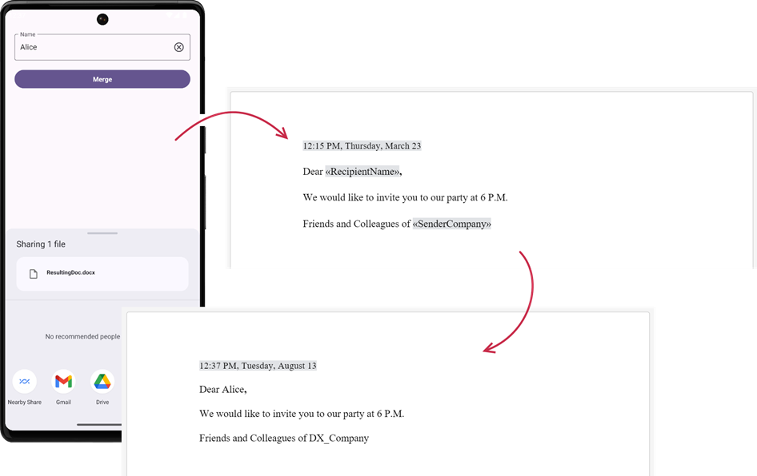

<!-- default badges list -->

<!-- default badges end -->
# DevExpress .NET MAUI Controls - Merge Editor Data to a Templated Document

This .NET MAUI example uses the DevExpress Office File API to generate email messages using mail merge operations. Data placeholders within the email template obtain data values from a database. The features outlined in this example require a license for the [Office File API](https://www.devexpress.com/products/net/office-file-api/). Our Office File API (Basic) is included in the following DevExpress Subscriptions: [Universal](https://www.devexpress.com/subscriptions/universal.xml), [DXperience](https://www.devexpress.com/subscriptions/dxperience.xml), and [Office File API](https://www.devexpress.com/products/net/office-file-api/).  

## Implementation Details

This example uses [RichEditDocumentServer](https://docs.devexpress.com/OfficeFileAPI/DevExpress.XtraRichEdit.RichEditDocumentServer?p=netframework) functionality to merge editor data to a templated .docx document.

## Files to Review

<!-- default file list -->
* [MainPage.xaml](./MainPage.xaml)
* [MainViewModel.cs](./MainPage.xaml.cs)
<!-- default file list end -->

## Documentation

* [Use Office File API to Implement Document Merge Operations](https://docs.devexpress.com/MAUI/405084/office-file-api-support/document-merge)
* [Word Processing Document API](https://docs.devexpress.com/OfficeFileAPI/17488/word-processing-document-api)

## More Examples

* [DevExpress Components for .NET MAUI - Demo App](https://github.com/DevExpress-Examples/maui-demo-app)
* [DevExpress .NET MAUI Data Grid - Export Data](https://github.com/DevExpress-Examples/maui-data-grid/tree/HEAD/CS/ExportGridData)
* [DevExpress Data Grid for .NET MAUI - Import Excel Data](https://github.com/DevExpress-Examples/maui-data-grid/tree/HEAD/CS/ImportExcelData)

<!-- feedback -->
## Does this example address your development requirements/objectives?

 

(you will be redirected to DevExpress.com to submit your response)
<!-- feedback end -->
